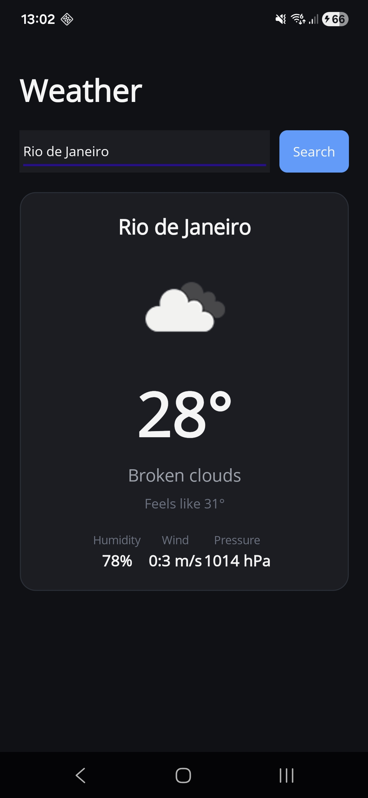

This is a simple weather app made using [**.NET MAUI**](https://learn.microsoft.com/en-us/dotnet/maui/), built on .NET 10 and targeting Android. It fetches data from OpenWeatherMap.

## Getting Started

> **Note**: Make sure you have the [.NET 10 SDK](https://dotnet.microsoft.com/download) and the `maui-android` workload installed before proceeding, plus a valid API Key for [OpenWeatherMap](https://openweathermap.org/api). Building from Linux is supported; iOS and Mac Catalyst targets require macOS and are out of scope here.

### Step 1: Install the MAUI Android workload

```sh
dotnet workload install maui-android
```

Verify with `dotnet workload list` — `maui-android` should appear.

### Step 2: Add your API key

Copy `Constants/ApiKeyConstant.cs.example` to `Constants/ApiKeyConstant.cs` and replace the placeholder with your OpenWeatherMap key:

```csharp
namespace WeatherAppMAUI.Constants;

internal static class ApiKeyConstant
{
    public const string OpenWeatherMap = "your_api_key_here";
}
```

`ApiKeyConstant.cs` is gitignored — your key never lands in source control. The `.example` file documents the expected shape for anyone cloning the repo.

### Step 3: Build and run

Connect an Android device via USB or wireless ADB, then:

```sh
dotnet build -t:Run -f net10.0-android
```

Or open the solution in Visual Studio / Rider / VS Code (with the .NET MAUI extension) and use the IDE's run button.

The app installs as `WeatherAppMAUI` on the device.

### App


# Architecture

Built with the modern MAUI / .NET stack:

- **UI**: XAML with compiled bindings (`x:DataType`), dark theme
- **State**: `WeatherViewModel` with a sealed `WeatherUiState` (Idle / Loading / Success / Error) and derived properties for XAML
- **MVVM plumbing**: [CommunityToolkit.Mvvm](https://learn.microsoft.com/en-us/dotnet/communitytoolkit/mvvm/) source generators (`[ObservableProperty]`, `[RelayCommand]`)
- **Async**: `async`/`Task` with `IAsyncRelayCommand`
- **HTTP**: `IHttpClientFactory` typed client + `System.Text.Json`
- **DI**: Built-in `MauiAppBuilder.Services` (`Microsoft.Extensions.DependencyInjection`)
- **Image loading**: MAUI's native `Image` control (remote URI support out of the box)

```
WeatherAppMAUI/
├── Constants/               // API key (gitignored) + template
├── Converters/              // IValueConverter implementations for XAML
├── Exceptions/              // Domain exceptions (not-found, invalid key)
├── Models/                  // API DTOs + sealed WeatherUiState
├── Platforms/Android/       // MainActivity, manifest, Android-specific bits
├── Resources/               // Icons, fonts, splash, styles
├── Services/                // IWeatherClient typed HTTP client
├── ViewModels/              // WeatherViewModel — presentation state + commands
├── App.xaml(.cs)            // Application root, global resources, dark theme
├── AppShell.xaml(.cs)       // Shell navigation host
├── MainPage.xaml(.cs)       // View — bindings only, no logic
└── MauiProgram.cs           // Entry point + DI registration
```

# Learning resources

- [Data binding and MVVM — Microsoft Learn](https://learn.microsoft.com/en-us/dotnet/architecture/maui/mvvm)
- [Commanding in .NET MAUI — Microsoft Learn](https://learn.microsoft.com/en-us/dotnet/maui/fundamentals/data-binding/commanding?view=net-maui-10.0)
- [Design a ViewModel in MVVM — Microsoft Learn (training module)](https://learn.microsoft.com/en-us/training/modules/design-mvvm-viewmodel/?source=)
- [MAUI — Usando o padrão MVVM e ICommand (Macoratti)](https://macoratti.net/23/06/maui_icmd1.htm)
- [.NET MAUI MVVM tutorial — YouTube](https://youtu.be/l_xriAE0Mws?si=iuJMiMg78K8Ijkvb)
- <a href="https://www.flaticon.com/free-icons/weather-app" title="weather app icons">Weather app icons created by Edi Prast — Flaticon</a>

<a href="https://www.flaticon.com/free-icons/weather-app" title="weather app icons">Weather app icons created by Edi Prast - Flaticon</a>